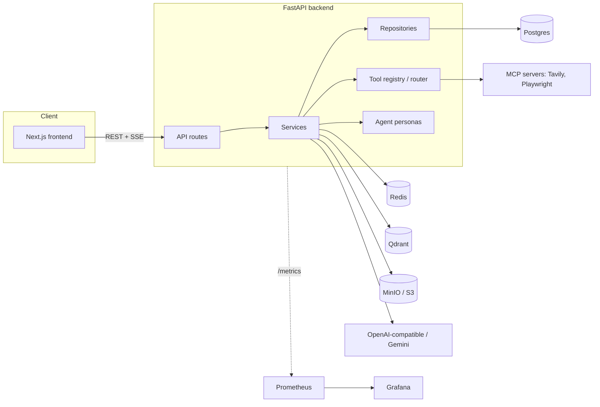

# Architecture

## Components

The backend is layered **routes → services → repositories**: routes handle HTTP concerns and
auth, services hold business logic and orchestrate providers/tools/repositories, repositories
are the only layer that touches SQLAlchemy models directly. This keeps `chat_service.py` (the
biggest service — it drives the whole chat turn) testable without a real DB by depending on
repository interfaces, and keeps routes thin enough that `backend/app/api/v1/` stays a readable
map of the API surface.

## Request flow: a chat turn

1. Frontend `POST`s to `/api/v1/conversations/{id}/messages` and opens the response as an SSE
   stream (`@microsoft/fetch-event-source` on the client, `StreamingResponse` on the server).
2. `chat_service.py` loads conversation history, relevant memories (Phase 4), and RAG context
   (Phase 5) if the conversation has associated documents, then builds the provider-agnostic
   `ChatMessage` list.
3. If an agent persona other than `general` is selected, `agents/definitions.py` supplies a
   system prompt and an `allowed_tools` allowlist; `browser` is the only persona that gets the
   21 Playwright tools merged into its registry — every other persona never sees them, not even
   as an unused schema entry (a real bug from the Phase 15 security pass: tools used to be
   merged into every persona's registry unconditionally).
4. The provider (`providers/openai_provider.py` or `providers/gemini_provider.py`) streams
   tokens back; if the model emits a tool call, `tools/router.py` validates it's in
   `allowed_tools` (checked again at call time, not just offered to the model — a provider isn't
   obligated to only return tool names it was given), executes it, logs it to
   `tool_call_log`, and the loop continues until the model returns a final answer.
5. The assistant message (plus any generated image attachments) is persisted inside a shielded
   `finally` block, so a client disconnect mid-stream doesn't lose the response server-side.
6. Metrics (`llm_requests_total`, `llm_request_duration_seconds`, `tool_calls_total`, etc.) are
   recorded at the same call sites, unconditionally — success or failure — so Prometheus/Grafana
   reflect real traffic, not just the happy path.

## Tool calling & MCP

`tools/registry.py` and `tools/router.py` are the single pipeline both native tools
(`calculator.py`, `sql_query.py`, `image_generation.py`) and MCP-backed tools
(`mcp_tool.py`, `browser.py` for the Playwright MCP server) go through — same audit logging,
same permission checks, same timeout handling. A new tool, whether native or MCP, is a
`BaseTool` implementation registered once; nothing else in the chat pipeline needs to know which
kind it is.

Two tools carry their own defense-in-depth beyond the shared allowlist:

- **`sql_query.py`**: `validate_readonly_sql()` rejects non-`SELECT`/multi-statement/commented
  SQL before it's ever sent to Postgres, and the query itself runs as `sql_demo_reader`, a
  Postgres role with `SELECT`-only grants scoped to an isolated `sql_demo` schema — verified
  live to be denied on `public.users` and on all writes, so the validator isn't the only thing
  standing between a bad model output and real data.
- **`browser.py`**: `_assert_safe_url()` resolves DNS and rejects private/loopback/link-local/
  reserved IPs before Playwright navigates anywhere (an SSRF guard), the MCP subprocess's file
  root is an isolated temp directory rather than the backend's own working directory (which
  contains `.env`), and `browser_evaluate`/`browser_run_code_unsafe`/`browser_file_upload` are
  excluded from the tool list entirely (arbitrary JS execution and local file access have no
  safe subset to allow).

## Data model

`backend/app/models/` — key tables: `user`, `conversation`, `message`, `message_attachment`
(nullable `message_id`, since an uploaded image is stored before the message that references it
exists; server-generated images use `create_for_message()` instead of the upload endpoint),
`document` + chunks (RAG), `memory` / `conversation_summary` (Phase 4), `folder`, `tag`,
`tool_call_log` (audit trail for every tool execution), `session` (refresh token tracking).

## Observability

`app/core/metrics.py` defines the custom Prometheus series; `prometheus-fastapi-instrumentator`
(pinned to `6.1.0` — the latest release has a hard `starlette>=1.0.0` requirement that conflicts
with FastAPI's `starlette<0.42.0` pin) handles standard HTTP metrics and exposes `/metrics`.
Structured JSON logging (`app/core/logging_config.py`) is opt-in via `LOG_FORMAT=json`, meant for
production where a log aggregator parses it — local dev defaults to plain text. See
[DEVELOPMENT.md](DEVELOPMENT.md#monitoring-stack-optional) for running Prometheus/Grafana
locally.

## Why not LangGraph (yet)

The chat pipeline is currently a linear function (`chat_service.py`), not a graph. A LangGraph
rewrite is planned but deliberately deferred to its own dedicated design discussion rather than
folded in incrementally alongside unrelated feature work — the state schema and node boundaries
deserve to be decided once, not organically grown.
